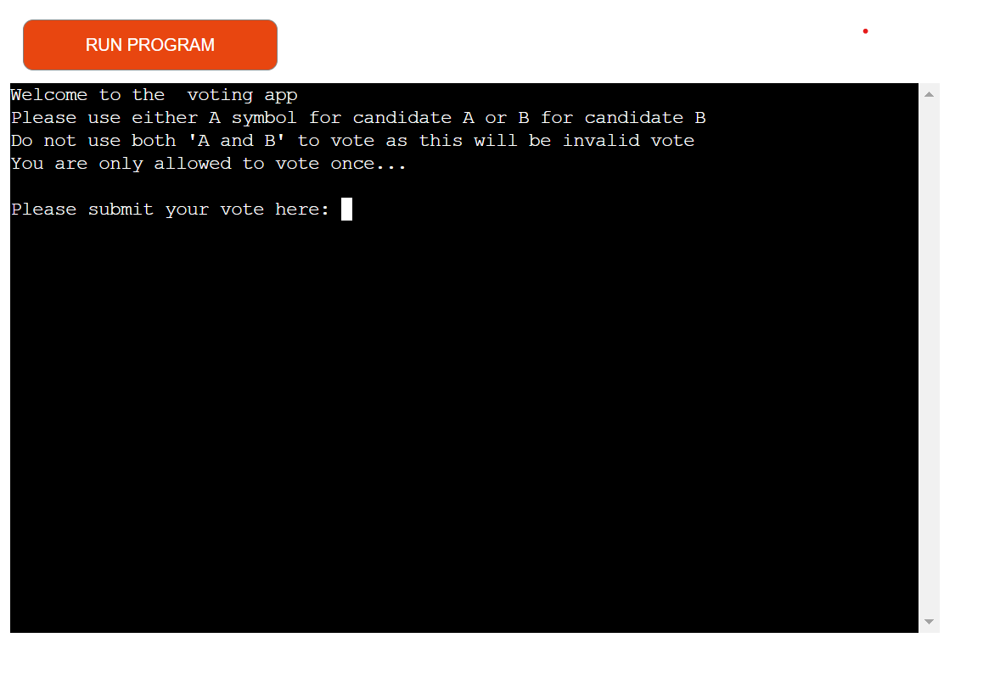
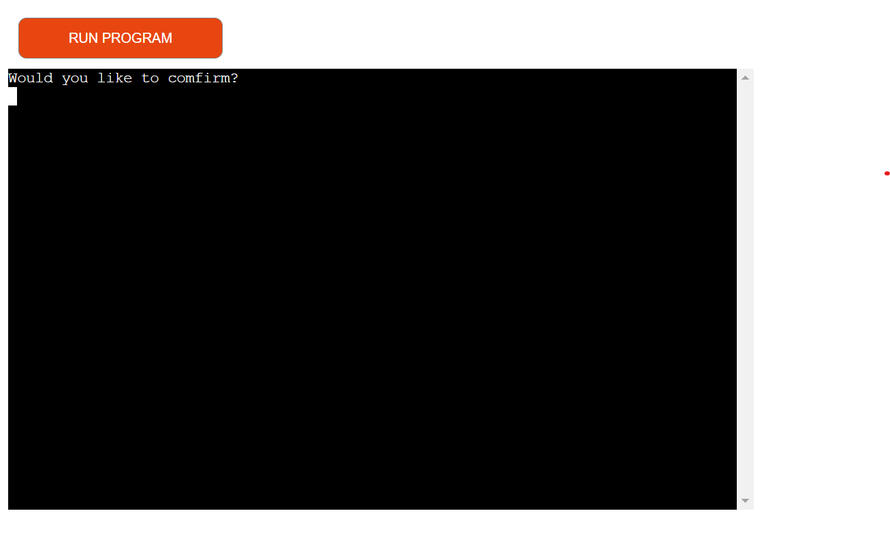
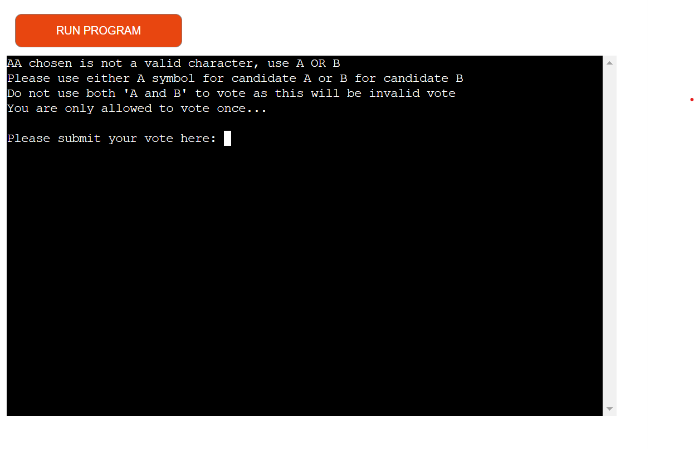
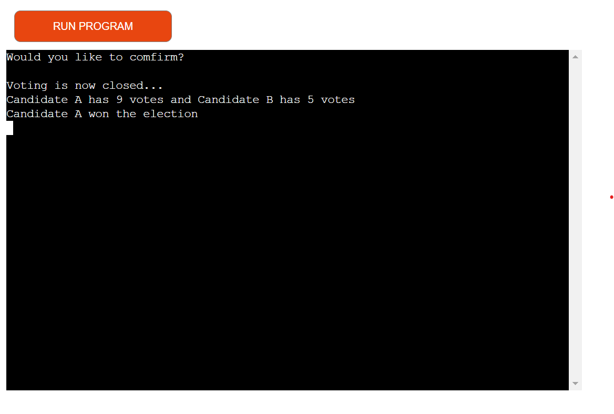
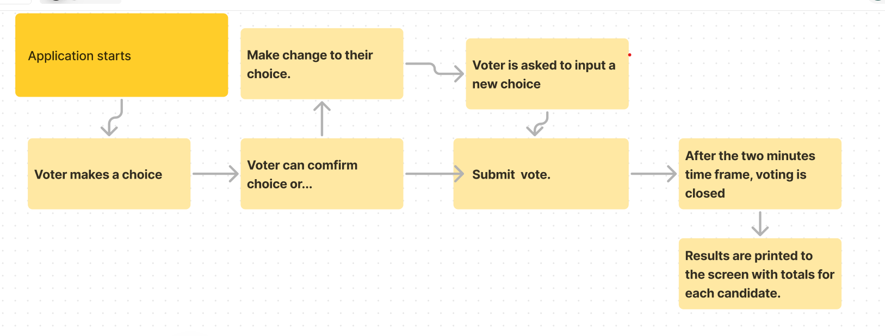

# VOTING APP

This is a voting app that is designed to run for a period of two minutes, a period that can be adjusted depending on the need. During this period the voters are allowed to vote and when the time runsout, the application stops and gives results of the voting outcome.

The app is intended to solve voting in remote countries that continously use manual ways to tabulate votes and also physical papers for voters to tick their preferred candidate. 

This application is completely digital so it avoids voter result manipulation, creates transparency in the voting process and also saves time on logistics.

# HOW THE APPLICATION WORKS

The voter gets a welcome message to the site and is asked given instructions on how to complete the voting process, having two options A for candidate A and B for candidate B. When the voter makes a choice, they are given an option to either comfirm their choice or make changes to their choice.

# MAKING CHANGES 

Here the user can revert their choice and make the right choice.

# ERROR HANDLING

Incase the voter enters wrong characters, they are given feedback to use the correct character so that their vote can be considered valid.

# DECLARING WINNER

After the two minutes time frame the application will automatically stop and a message displayed indicating who the winner is and final results of the election printed aswell.

# DESIGN

The application is based on this design about how the voting process will be and what to expect at each stage.

